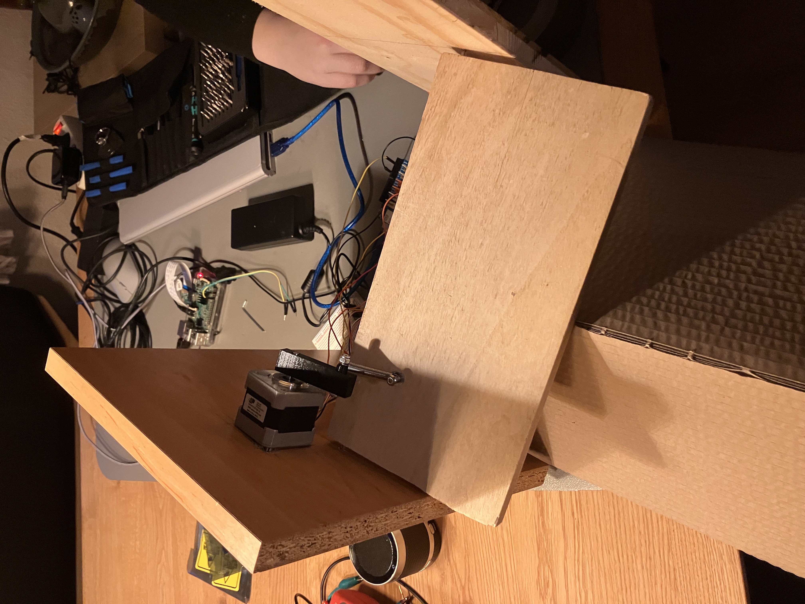
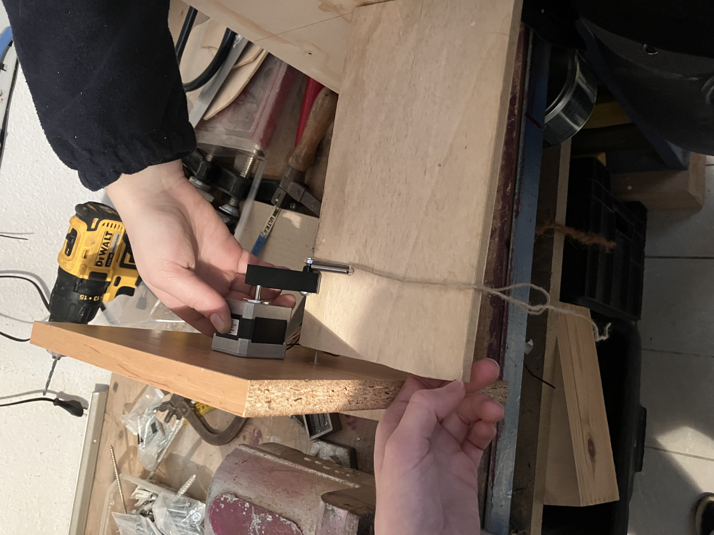
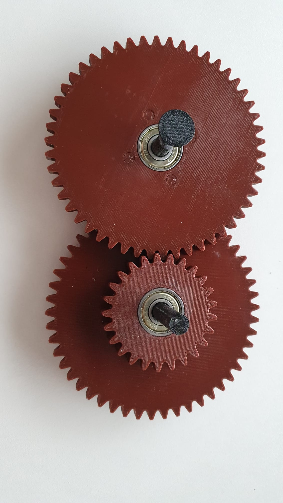
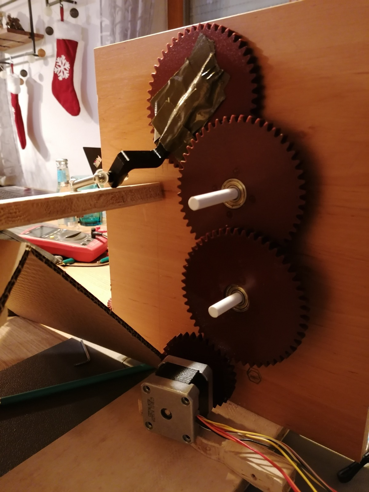
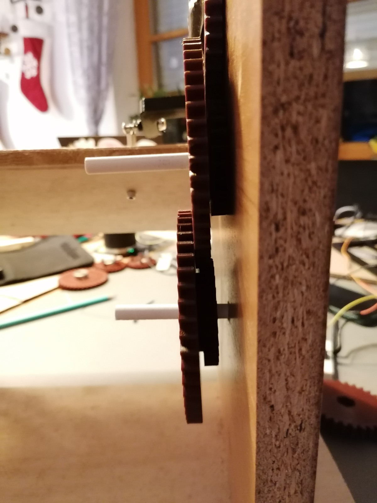
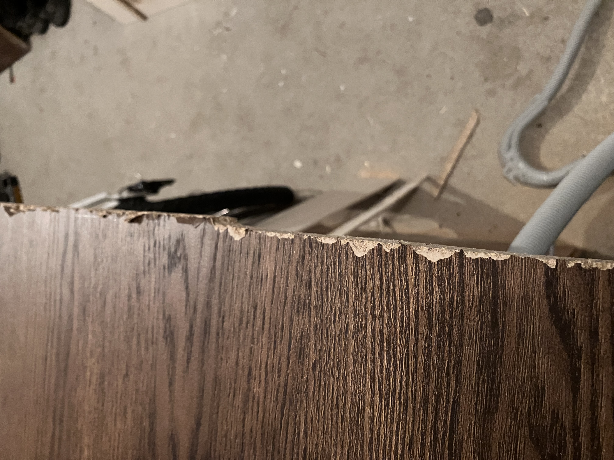
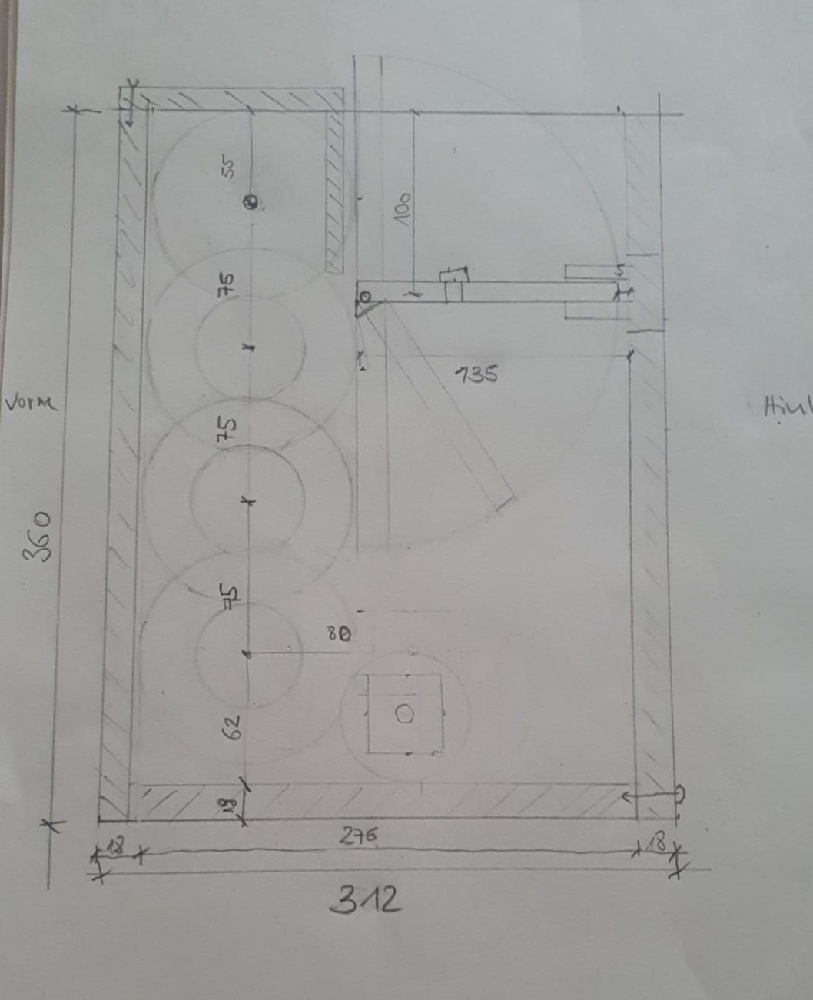
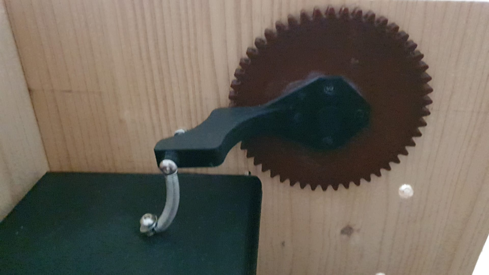
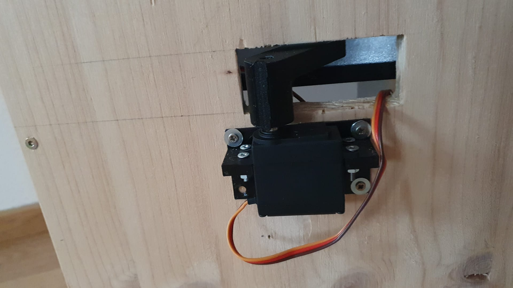

# Implementation of the bin
In the following the implementation of the bin and the catapult are described. The goal of this was to have a housing into which the trash is thrown. Inside of this a catapult is placed, that either throws the trash back out or throws it into the bin.

## Iteration A

**TODO** first cardboard prototype und motor/rasperyPi/arduino setup

## Iteration B

In the second iteration, cardboard was used again, with some adaption. Especially as it is easier and faster to cut holes into it, than it is with wood, another version with cardboard was tried. The plan was that this way it would be easier to determine the correct position for the motors and the catapult on the housing. 

To stabilize the new construction, additional cardboard was added on the inside of the bin. However, after cutting holes for the motors and the catapult, it was still not stable enough to use it in a propper manner for testing. Sadly no pictures were taken of this version.

## Iteration C

After the stabilized version with cardboard did not work out aswell, left over wood was used for the base construction. As the catapult would only be mountet to two sides of the bin, the construction consists of a base plate to which two parallel plates are attached. Another wood plate was cut to the width between the two parallel plates, to be used as the baseplate for the catapult. 

To place the catapult-baseplate in the base construction two holes were drilled into the two sideplates at the same hight. Then two holes were drilled into the sides of the catapult plate. Using two long screws, a little thinner than the drilled holes, the catapult plate was placed in the base construction. This way the catapult can turn around this axis. The construction can be seen in the following image.

As can be seen in the image, the stepper motor was mountet to one of the side plates. To mount the spring onto the stepper motor, a spectial piece was 3d printet. 

In the beginning a piece of wood was used instead of the 3d printet part. To mount this onto the motor a hole was drilled into the wood. However no matter how small the hole was, it either did not fit onto the metal pin or it would turn on the pin.

Therefore, the 3d printet part has a hole that exactly fits the D-shape of the motors metal pin, so that it would not turn in an unwanted manner.

To evaluate where the spring should be mountet onto the catapult plate, so that the plate could turn up and down in the wanted manner, a cord was used. This way it was possible to try out multiple differnt postions, by pulling on the cord, before drilling holes into the wood.

After screwing everything together and adding the electronics, the  catapult was tested. This test lead to the conclusion, that the steppermotor was not able to pull the spring far enough, to throw something with the catapult.

## Iteration D
**TODO** Lisa was hast du da dann noch probiert? Du hast ja irgendwas beim motor dann noch anders verkabelt, wo dann des shield vom motor so überhizt ist?

## Iteration E
As the steppermotor by itself was not strong enough to pull the spring as far as needed, without the motorshield overheating, the next idea was to use 3d printet gears to reduce the force the steppermotor has to generate. The used gears consist of two combined gears one with double the radius of the other one. 

By always combining a bigger gear with a smaller gear, as can be seen in the image above, the spring could be pulled further and further with every additional gear. When using four combined gears and a small gear on the stepper motor, it was possible to pull the spring far enough to throw things with the catapult.

 

Two problems that occured during testing, were that the part and the gear the spring was mountet to would bend a lot due to the force produced by the spring. This resultet in the gear not matching with the next gear propperly or the whole gear falling out of the hole it was mountet on. The other gears were also moving on the sticks the were mountet onto, which made the whole construction a bit unstable.

**TODO**
-Zahnräder funktionalität iwi noch besser erklären oder so genug?

## Iteration F
**TODO** brett für katapult 3d printed und runterhaltmechanismus v1 verworfen

## Iteration G
The original plan was to use dark veneered wood and crafting glas for the final bin. By using crafting glas for the front and top of the bin, users would be able to see the inside of the bin with the gears, which looks quite interesting. The main reason for using the veneered wood was, that this wood was leftover wood and no extra costs would emerge for buying new wood.

However, when trying to cut the veneered wood, the cuts did not look great, as can be seen in the image below. 

After trying a jigsaw and a circular saw the only other option would have been to cut the wood by hand. Therefore, the decision was made to use other wood that could be cut better using the jigsaw. With that saw it was a bit hard to cut exact straight lines, but in the end everything fit together better than expected.

With the measurements gained from the previos wood prototype the needed holes could be drilled and morised.
 
Additionally a new more stable part for mounting the spring to the gear, new pins for mounting the gears to the sides of the bin and small zylinders to prevent the gears from moving on these pins were 3d printet. 

The creafting glass is mounted to the bin using **TODO** finales foto und letzte schritte