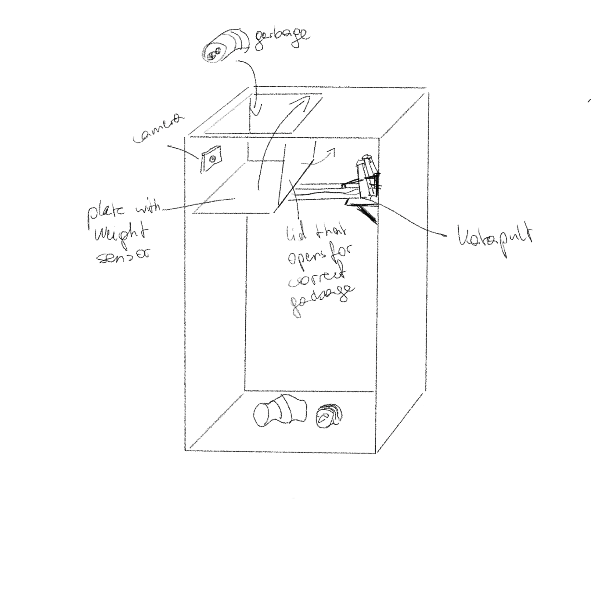

# Wastebin

Project documentation for the **Design for Physical Prototyping** course 2022/23 focusing on the topic of **Uncomfortable Devices**.

## Abstract

TODO: Shortly summarize the intentions and ideas behind your project. 
Lorem ipsum dolor sit amet. This project builds upon the idea of [Chindōgu](https://en.wikipedia.org/wiki/Chind%C5%8Dgu), the practice of inventing ingenious everyday gadgets that seem to be ideal solutions to particular problems, but which may cause more problems than they solve. Lorem ipsum dolor sit amet.

## Concept

The idea for this project was to create a wastebin, that throws trash that does not belong into the bin back outside. Furthermore, the bin insults the person with audio output.
To throw the trash out, a catapult would be used. For the construction of the catapult multiple references were found online. However as it would not only have to catapult trash outside of the bin, but also throw correct objects into the bin, these online references were used as a starting point. After sketching differnt versions of the catapult for the usecase, the catapult in use was decided on.
The detection of wrong garbage was a bit more unclear. Multiple options were considered. The simpelest beeing a wizard of oz prototype, where a person would check whether the object belongs into the bin or not and press a button to generate the correct action. Another simplified idea was to assign a color to each garbage class and use a colorsensor to classify the garbage. The most advanced idea was to use machine learning to classify the garbage thrown into the bin.

The image below shows a first sketch of the wastebin.

TODO Ergänzungen? Here you could summarize your project proposal.
How did you plan to build your prototype? 
Did you arrive at your idea immediately or did you iterate over it? Describe your process. 

## Implementation

Describe how you implemented your project. Which iterations did go through? What did work and what did not work? Did you adapt your original idea to practical difficulties during implementation?

### Iteration A

Cardboard prototype

### Iteration B

Another cardboard try?

### Iteration C

Wood planks

### Iteration D

Wood selfcut

### Iteration E

Wood cut by OBI

## Materials and tools

What materials and hardware did you use in your iterations and your final prototypes? Did you modify any ready-made devices? Did you build it from scratch? What tools did you use to implement your prototype?

## Conclusion

Shortly summarize your project implementation process and the resulting outcome.
What problems and limitations did you face? What experiences did you make 

{: .note }
Edit this page and all the subpages according to the specifics of your project. You don't need to use the provided headlines, just keep it well structured. If one part of the documentation gets too lengthy put it into a subpage.
